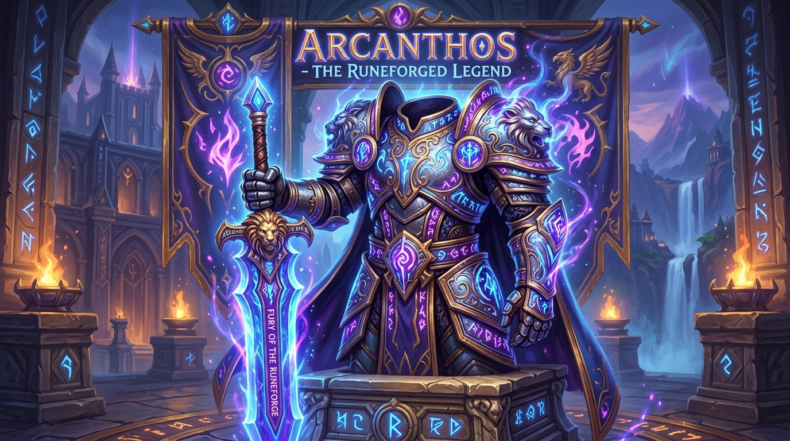

# mod-no-gems



mod-no-gems is an AzerothCore WotLK module that removes gem sockets from items at server startup and replaces their socket value with balanced native item stats. It works entirely in memory, requires no client addon or database item overrides, preserves socket-bonus value, cleans legacy gemmed gear, and is compatible with Playerbots.

## Overview

mod-no-gems dynamically removes all gem sockets from items across the entire game database and replaces them with balanced, synergistic native stats.

Unlike traditional custom item solutions that require SQL table overrides, synthetic item IDs, or custom client addons, mod-no-gems modifies the base item templates directly in memory upon server startup. The game client natively renders the transformed items with zero empty socket holes, zero artificial flavor text, and clean, properly grouped Blizzard tooltips.

## Features

- **In-Memory Template Processing**: Transforms all socketed item templates in memory when the world server initializes. The world database remains completely pristine and unmodified.
- **Native Blizzard Tooltip Display**: Primary attributes (Strength, Agility, Stamina, Intellect, Spirit) are rendered as standard white base stats. Combat ratings (Critical Strike, Haste, Hit, Armor Penetration, Defense, etc.) and Attack/Spell Power are rendered as standard green Equip lines.
- **Automatic Tooltip Stat Grouping**: Base stats and equip lines are automatically sorted and grouped so that white attributes always appear together at the top of the tooltip, and green equip effects appear together at the bottom.
- **Synergistic Stat Selection**: Replacement affixes are dynamically selected based on socket color and the item's existing stat archetype (for example, red sockets on caster gear grant spell power or intellect, while red sockets on plate gear grant strength or attack power).
- **Socket Bonus Preservation**: Original item socket bonuses from DBC enchantment records are scaled and folded into the item stats before sockets are cleared.
- **High-Performance Login Pipeline**: Scans equipped, bag, and bank items cleanly on login. Stat recalculations (`_RemoveAllItemMods()` / `_ApplyAllItemMods()`) execute **only** when legacy gems are actually cleansed, completely eliminating login lag spikes and packet floods for regular logins.
- **Immediate Client & Database Synchronization**: Cleansed items are instantly synchronized to client tooltips via `item->SendUpdateToPlayer()` and flagged for persistent database storage (`ITEM_CHANGED`).
- **Dynamic Template Synergy**: Provides thread-safe, double-checked locking (`std::shared_mutex`) to seamlessly cleanse dynamically generated or scaled items on-the-fly (e.g. via `mod-item-level-scaling`).
- **Memory Optimized**: Pre-allocated hash structures and lean in-memory backups eliminate heap fragmentation and table rehashing during world startup.
- **Item Class Safeguard**: Direct usage and socketing of gem items as well as belt socket upgrade items are blocked to prevent accidental loss of materials.
- **Playerbot Compatible**: AI playerbots natively recognize items as having zero sockets and evaluate upgraded gear accurately using standard stat weight calculations.
- **Zero Client Addons & Zero Core Edits**: Works with completely unmodified 3.3.5a game clients and without touching a single line of core AzerothCore code.

## Requirements

- AzerothCore revision with support for C++20 (supported on master and Playerbot branches).
- World of Warcraft Client 3.3.5a (12340).

## Installation

1. Navigate to your AzerothCore `modules` directory:
   ```bash
   cd azerothcore-wotlk/modules
   ```
2. Clone this repository:
   ```bash
   git clone https://github.com/Ildourol/mod-no-gems.git
   ```
3. Re-run CMake to register the module:
   ```bash
   cd ../build
   cmake ..
   ```
4. Build the project using your compiler (MSBuild on Windows or Make/Ninja on Linux).
5. Copy the configuration file:
   ```bash
   cp modules/mod-no-gems/conf/mod_no_gems.conf.dist configs/modules/mod_no_gems.conf
   ```

## Configuration

Settings can be customized in `mod_no_gems.conf`:

| Setting | Default | Description |
| :--- | :--- | :--- |
| `ModNoGems.Enable` | `1` | Enable or disable the module entirely. |
| `ModNoGems.ConvertLegacyGearOnLogin` | `1` | Cleanses legacy socket gem enchantments from bags and bank on login. |
| `ModNoGems.BlockGemUse` | `1` | Prevents players from using gem items or belt buckle socket items. |
| `ModNoGems.StatMultiplier` | `0.5` | Multiplier applied to replacement stat budgets (0.3 = conservative, 0.5 = balanced, 1.0 = full power). |
| `ModNoGems.MetaMultiplier` | `1.0` | Multiplier for meta sockets (1.0 = equivalent to 1 normal socket, 0.0 = zero stats from meta). |
| `ModNoGems.IncludeSocketBonus` | `1` | Folds original item socket bonuses into the replacement stats. |
| `ModNoGems.SocketBonusMultiplier` | `0.5` | Multiplier applied to folded socket bonuses. |
| `ModNoGems.Debug` | `0` | Enables verbose debug logging during server initialization. |

## In-Game Commands

The module includes a command suite accessible by Game Masters (Security Level 3 / Administrator):

- `.nogems reload`: Reloads the module configuration file without restarting the world server.
- `.nogems stats`: Displays the total number of item templates modified in memory.
- `.nogems info <itemId>`: Shows the original socket configuration, socket bonus ID, and stats count for a given item entry.
- `.nogems cleanse <player>`: Manually purges legacy gem enchantments from a targeted or specified player across their equipped items, inventory bags, and bank, updating client tooltips and recalculating their character sheet attributes.

## Client Cache Notice

The World of Warcraft 3.3.5a client locally caches item information in `Cache/WDB/enUS/itemcache.wdb`. When enabling the module for the first time or modifying item templates, delete your client's `Cache` directory so the client requests updated template definitions from the server.

## License

This module is released under the GNU General Public License v2.
